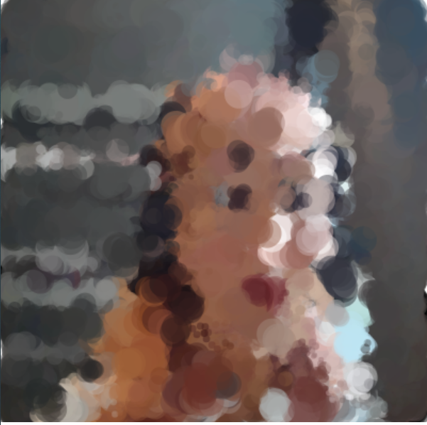
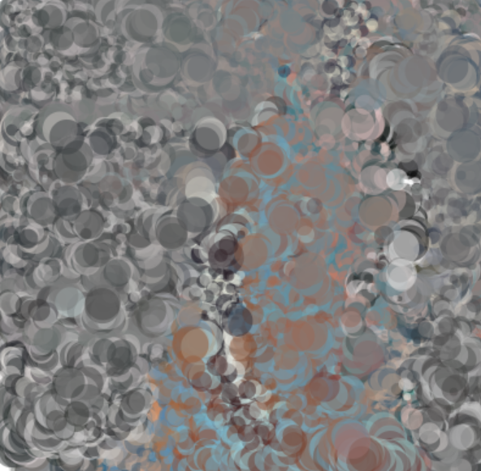
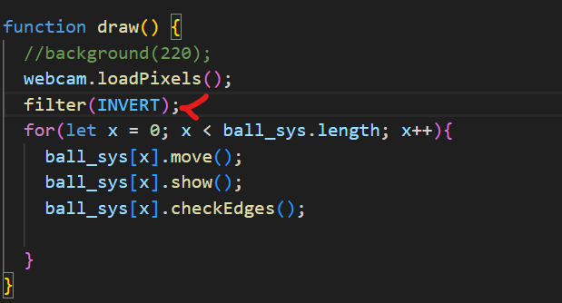
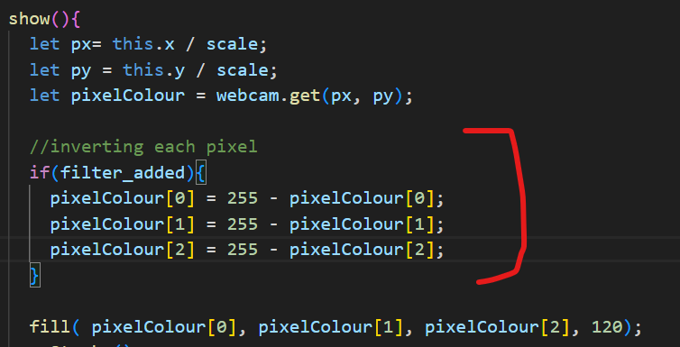
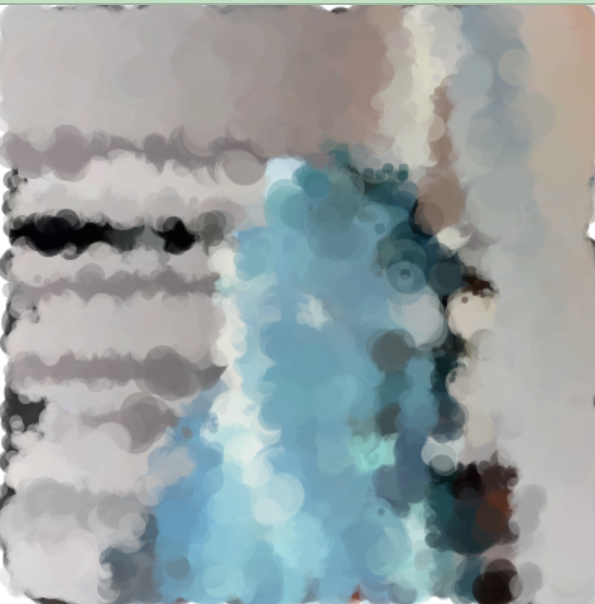
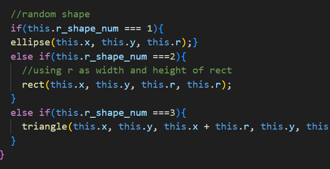
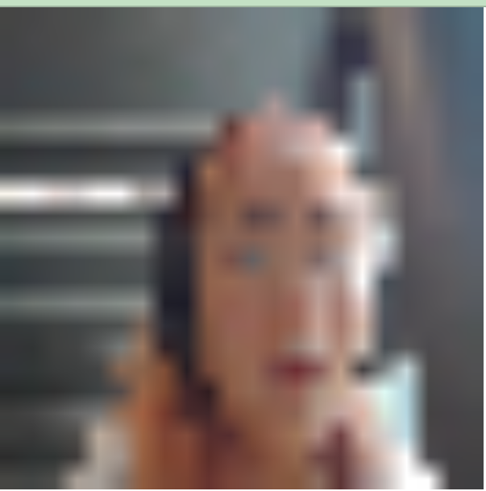
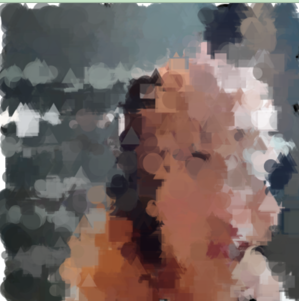

# workshop-task-9
# Live Video Capture
Link to completed website here -> (add page)

## Goals for this workshop
- Make an experimental 'smart mirror' using live video capture.
- Include manipulations at the level of the pixel.
- Make a new repository for your p5.js project on your GitHub account, publish your sketch as a webpage, and include a README file in your repository with a URL to the webpage along with documentation of your work.

## Planning
For this workshop I had a very limited amount of time so I decided that I would begin my copying Leo's code from the demonstration 1:1, then once I had that website functioning I would modify the code and add extra details.

## Testing Leo's code
I copied Leo's code from the demonstration and opened the website in my browser to confirm it was working.
This is what it looked like (below):

## Modifying code experiments
### Invert filter
First I tried applying an invert filter, I did this by applying an invert filter in the draw function.

The result is shown on the above left picture, the filter did apply but it did not look the way I want it to.
I'm wasn't sure what the reason was so I decided to try out drawing the ellipses with inverted rgb values rather than using the filter.

This was the result:

I was much happier with this, so I used this approach rather than the filter.

To toggle the invert filter on and off, I added a mousePressed() function and a boolean variable that would turn the filter on and off.

### Adding more shapes
Next I wanted to add more shapes to the sketch, so I changed the Ball class into the Shape class and the ball array into the shape array.

Next I generated a random number from 1 to 3 within the for loop ion the setup() function (below, right), then depending on the value, drew the shape assigned to it within the Shape class show() function (below, left).

I initially made a mistake here by trying to add my r_shape_num variable to my Shape class like this:

This caused my screen to look like this:

There were no shapes drawing, and clicking the screen to turn the invert filter was not working.
I tried drawing my shapes outside the if statements, and they worked so I had a look at the shape class again and figured it out.
After rewriting my code to:

The shapes drew as I wanted them to:

### Adding more filters
I then decided to add more filters.
To do this I generated a random value from 1 to 6 in the mousePressed() function

A filter is applied in the draw function based on the random value.

Below are some examples of what the filters look like:
left = blur, middle = erod, right = posterize.

### Adding text and final touches

My live video feed was working as I wanted it to now.
I added some text to the screen:

And moved my canvas into the middle of the screen like a real mirror:

I also added a song:

Link to the song -> (https://www.youtube.com/watch?v=I8KmHPct_es), I am not the creator of the song, it belongs to Bogdan Razynski.

